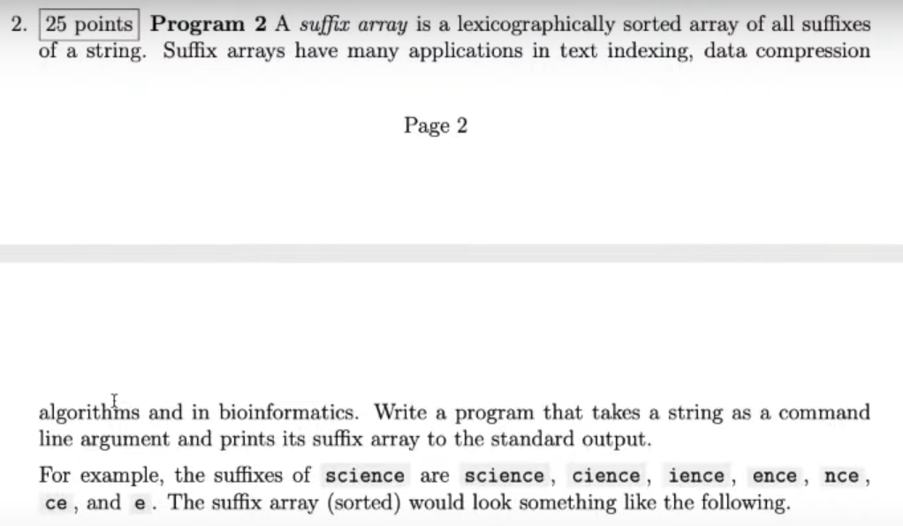
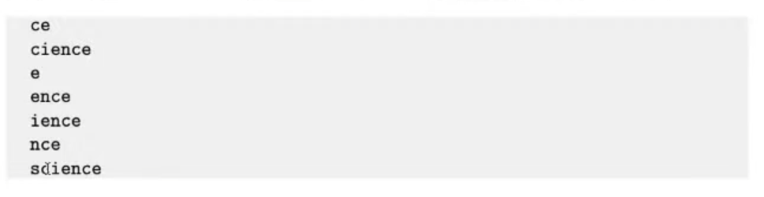
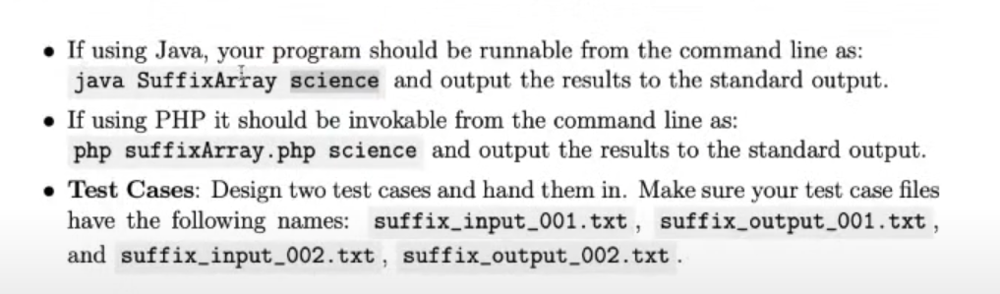

# 1.模拟如何做作业







Tips : 做一件事，把它拆分成若干个 小的部分，做一点，标记完成，和很有成就感 

## (1) 注 释文档 javadoc 

* **所有的类都要注释**

* java style comments

  ```java
  /**
   * This program takes a string as a command line argument and out puts a suffix array
   *
   * For more information see
   * <a href="https://baike.baidu.com/item/%E5%90%8E%E7%BC%80%E6%95%B0%E7%BB%84/8989867?fr=aladdin">百度百科</a>
   *
   * @author clay
   *
   */
  ```

## (2) 写算法(程序模块)

```java
        // 1. read the command line argument as a string
        //    remember do the error handling, what if the program did not have arguments

        // 2. create a collection of suffixes

        // 3. sort teh collection

        // 4. output the collection
```


## (3) 写测试实例 test case 

**输入**

```
computer
```

**期待的输出**

```
computer
er
mputer
omputer
puter
r
ter
uter
```


# 2. 变量（variable）

* Java is statically typed : all the variable must be declared (both their type and their name) before you can use them

  java 和 C C++ 一样， 强类型，变量使用前要声明

```java
int x = 10;
double pi = 3.1415926
char initial = 'C'
// other: long short byte float

boolean isStudent = true
isStudent = false
```

